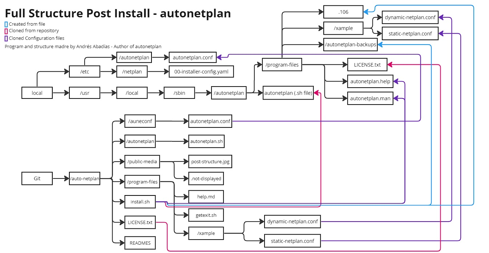

# Auto Netplan - GNU/Linux Automatic Net Config
- Programa por [Nisamov](https://github.com/Nisamov)
Programa configuracion automatica Netplan
Este programa se centra en la automatización de configuración del programa netplan.

Auto Netplan es una herramienta diseñada para automatizar la configuración de redes en sistemas GNU/Linux utilizando Netplan. Simplifica el proceso de configuración y evita problemas comunes como errores de sintaxis o la introducción de configuraciones incorrectas.

Se recomienda seguir la [guía](https://github.com/Theritex/LinuxCommands/tree/main/system_data/network_configuration/netplan_net) creada por Nisamov previamente como apoyo durante la configuración manual.

El programa cuenta con un instalador, este instalara el programa dentro del sistema operativo, para ejecutarlo es necesario estar dentro de la ruta o especificar la ruta del fichero para su ejecución `bash (ruta)/install.sh`

## Estructura del Programa y Explicacion Visual
Estos ejemplos han sido creados para la completa comprension del programa.

### Estructura tras la instalacion
Esta es la estructura correspondiente tras la ejecucion del script `install.sh`, el cual clona y crea rutas dentro del sistema con el objetivo de repartir el programa de una forma completa dentro del mismo.

### Estructura durante la creacion
Esta es la ruta de los ficheros del repositorio, con este esquema es posible trazar la ruta completa de cada fichero, asi como observar la creacion de nuevos, este esquema esta simplificado, para comprender la estructura completa del programa,s e recomienda ejecutar el siguiente comando:
```bash
# Abrir el fichero en texto plano para su compresion con permisos de super usuario
sudo nano ./install.sh
```

Mediante la imagen mostrada previamente, es posible comprender el funcionamiento y clonacion de los ficheros del repositorio, tras la ejecucion del fichero `install.sh`, este cuenta con una seccion del fichero de isntalacion que borra el repositorio clonado, limpiando asi espacio ya no necesario en el sistema, siendo esta escript el siguiente:
```bash
# Tras la instalacion, el instalador, borrara el repositorio clonado para liberar espacio
# Verificar si la ruta $SCRIPT_DIR existe
if [[ -d "$SCRIPT_DIR" ]]; then
    # Si la ruta existe, eliminar de forma recursiva el directorio
    sudo rm -rf "$SCRIPT_DIR"
    # Mensaje de eliminación exitosa
    echo "[#] Se ha eliminado de forma recursiva el repositorio clonado."
else
    # Si la ruta no existe, mostrar un mensaje indicando que no existe
    echo "[#] La ruta '$SCRIPT_DIR' no existe."
fi
```


## Instalación
Para instalar Auto Netplan, sigue estos pasos:

Clona el repositorio:
```sh
sudo apt install git
git clone https://github.com/Nisamov/auto-netplan
```

Navega hasta el directorio del repositorio clonado:
```sh
cd auto-netplan
```
Ejecuta el instalador:
```sh
sudo bash install.sh
```

El instalador copiará los archivos necesarios y configurará los permisos adecuados para que el programa funcione correctamente.

Uso
Una vez instalado, puedes llamar al programa autonetplan.sh con los siguientes parámetros:
```
-h / --help: Muestra la ayuda del programa.
-r / --remove: Desinstala el programa.
-x / --execute: Continúa con la ejecución del programa.
Además, puedes especificar el modo de configuración (-m para manual, -a para automático), el tipo de configuración (-f para DHCP, -s para estática), la interfaz de red, la dirección IP, la máscara de red y la puerta de enlace.
```

El programa devuelve los siguientes códigos de salida:

`0`: Éxito.

`1`: Error en la introducción de valores.
Notas
Se recomienda seguir la guía de configuración creada por Nisamov como apoyo durante la configuración manual.

Después de la instalación, los archivos clonados se eliminarán recursivamente, liberando espacio en el sistema. de instalación:
```sh
SCRIPT_DIR="$( cd "$( dirname "${BASH_SOURCE[0]}" )" &> /dev/null && pwd )"
```

## Ruta instalacion programa
```sh
# Ruta instalacion super usuario
INSTALL_DIR="/usr/local/sbin"
# Ruta ficheros programa super usuario
PROGRAM_FILES="/usr/local/sbin/auto-netplan/"
```

```bash
# Tras la instalacion, el instalador, borrara el repositorio clonado para liberar espacio
# Funciones: Ubicar ruta actual, localizar ficheros de repositorio, borrar de forma recursiva el programa
sudo rm -rf $SCRIPT_DIR
```

Tras ser ejecutado el script de instalacion, el repositorio es eliminado para liberar almacenamiento.