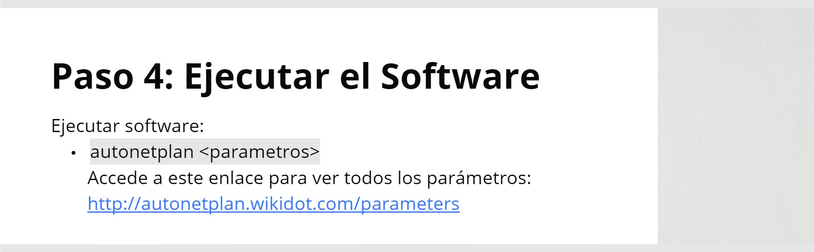

<!-- Software creado por Andrés Ruslan Abadías Otal -->
<!-- Seccion comentada sin relevancia


-->


```sh
sudo apt install git
```

```sh
git clone https://github.com/Nisamov/autonetplan
```

```sh
cd autonetplan
```

```sh
sudo bash install.sh
```

```sh
autonetplan <parametros>
```
> Accede a la página web haciendo clic [aqui](http://autonetplan.wikidot.com/parameters).
