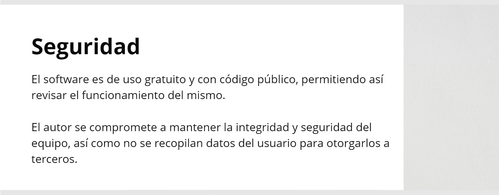
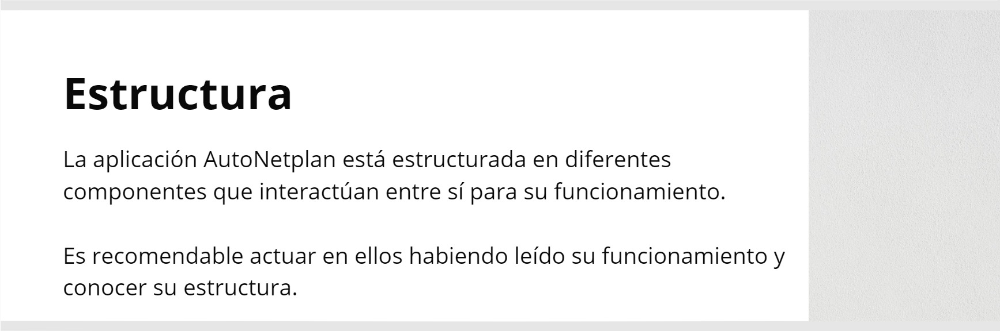
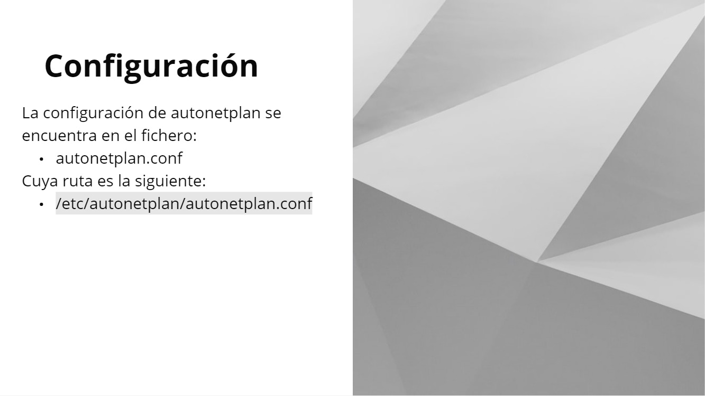
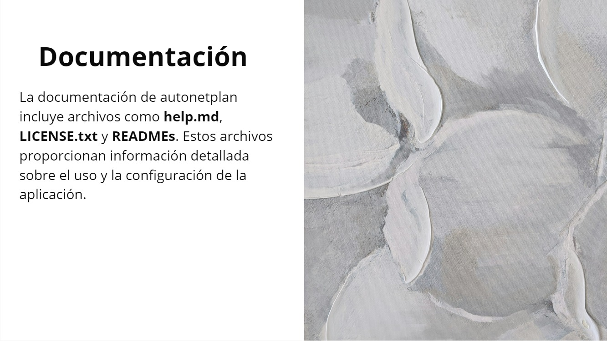
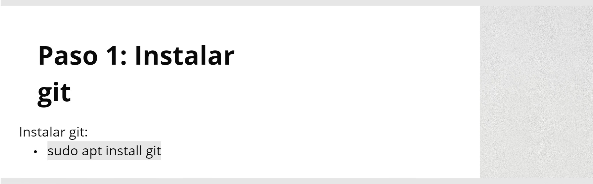
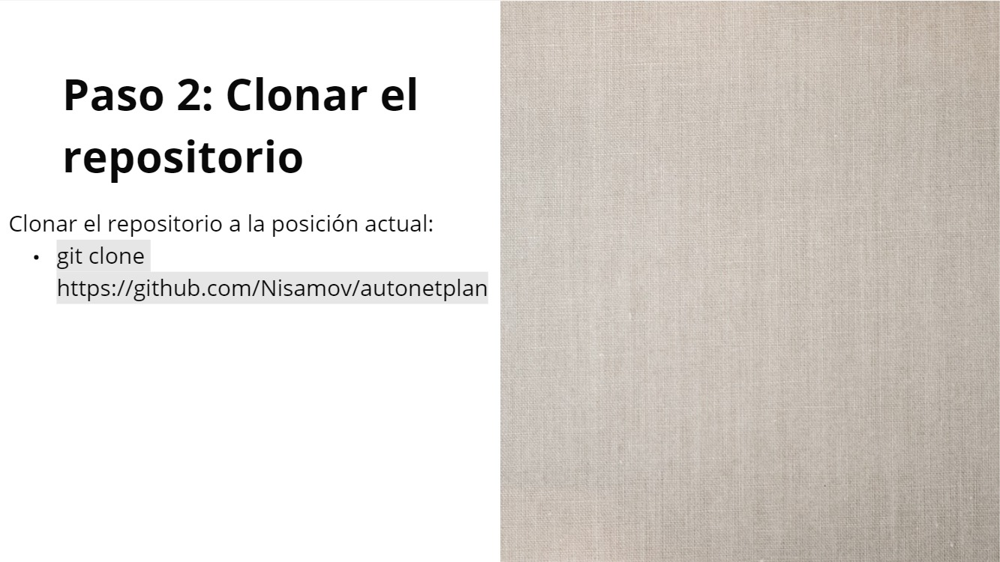
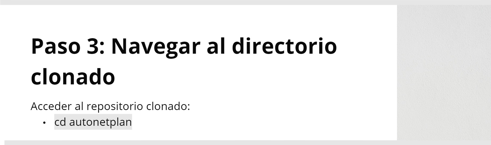
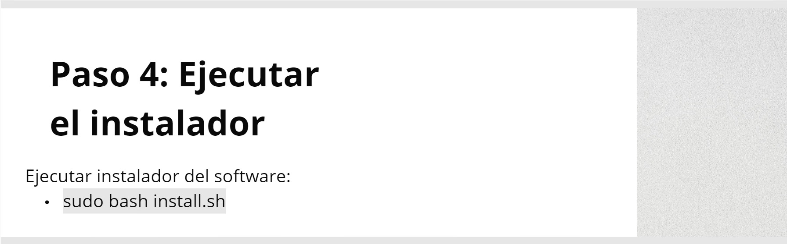

<!--Software creado por Andrés Ruslan Abadías Otal-->













```sh
sudo apt install git
```

```sh
git clone https://github.com/Nisamov/autonetplan
```

```sh
cd autonetplan
```

```sh
sudo bash install.sh
```