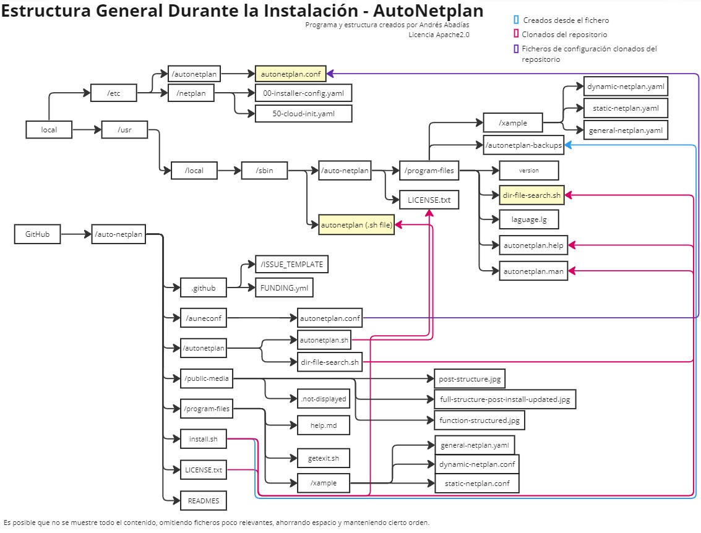
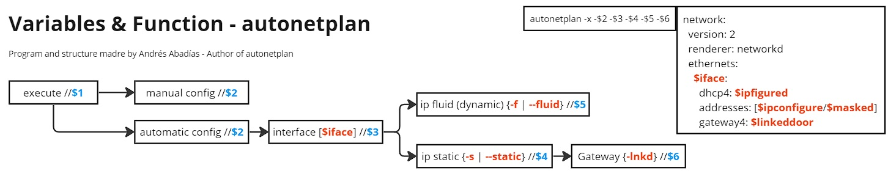

# Auto Netplan - Automatic NetWork Configuration
- Programa por [Nisamov](https://github.com/Nisamov)
Programa diseñado para automatizar la configuración del software Netplan.

Auto Netplan es una herramienta diseñada para automatizar la configuración de redes en sistemas GNU/Linux utilizando Netplan. Simplifica el proceso de configuración y evita problemas comunes como errores de sintaxis o la introducción de configuraciones incorrectas.

Se recomienda seguir la [guía](https://github.com/Theritex/LinuxCommands/tree/main/system_data/network_configuration/netplan_net) creada por Nisamov previamente como apoyo durante la configuración manual.

El programa cuenta con un instalador, este instalara el programa dentro del sistema operativo, para ejecutarlo es necesario estar dentro de la ruta o especificar la ruta del fichero para su ejecución `bash (ruta)/install.sh`

## Estructura del Programa y Explicacion Visual
Estos ejemplos han sido creados para la completa comprension del programa.

### Estructura Tras la instalacion
Esta es la estructura correspondiente tras la ejecucion del script `install.sh`, el cual clona y crea rutas dentro del sistema con el objetivo de repartir el programa de una forma completa dentro del mismo.

### Estructura General Durante la Creacion
Esta es la ruta de los ficheros del repositorio, con este esquema es posible trazar la ruta completa de cada fichero, asi como observar la creacion de nuevos, este esquema esta simplificado, para comprender la estructura completa del programa,s e recomienda ejecutar el siguiente comando:
```sh
# Abrir el fichero en texto plano para su compresion con permisos de super usuario
sudo nano ./install.sh
```

Mediante la imagen mostrada previamente, es posible comprender el funcionamiento y clonacion de los ficheros del repositorio, tras la ejecucion del fichero `install.sh`, este cuenta con una seccion del fichero de isntalacion que borra el repositorio clonado, limpiando asi espacio ya no necesario en el sistema, siendo esta escript el siguiente:
```sh
# Tras la instalacion, el instalador, borrara el repositorio clonado para liberar espacio, unicamente tras comprobar la existencia de los ficheros imprescindibles para el programa.
read -p "¿Desea borrar el repositorio clonado? [s/n]: " deleteRepos
    if [[ $deleteRepos == "s" || $deleteRepos == "S" ]]; then
    # Verificar si la ruta $SCRIPT_DIR existe
        if [[ -d "$SCRIPT_DIR" ]]; then
            # Si la ruta existe, eliminar de forma recursiva el directorio
            sudo rm -rf "$SCRIPT_DIR"
            # Mensaje de eliminación exitosa
            echo "[#] Se ha eliminado de forma recursiva el repositorio clonado."
        else
            # Si la ruta no existe, mostrar un mensaje indicando que no existe
            echo "[#] La ruta '$SCRIPT_DIR' no existe."
        fi
    else
        echo "El repositorio no se eliminara del sistema"
    fi
```
## Sistema de Lectura de Datos

Mediante este esquema, es posible visualizar de una forma mas comoda, la lectura de datos, permitiendo comprender como funcionan los ficheros principales y como se comprueban los mismos, siendo asi un ejemplo, el fichero `dir-file-search.sh`, el cual se encarga de revisar los ficheros.


## Instalación
Para instalar Auto Netplan, sigue estos pasos:

Instalar git:
```sh
# Instalar git, con el que se llevara a cabo la clonacion del repositorio
sudo apt install git
```


Clona el repositorio:
```sh
git clone https://github.com/Nisamov/autonetplan
# Ejemplo de instalacion practica
# git clone https://github.com/Nisamov/autonetplan /home/user/Github/cloned/
```

Navega hasta el directorio del repositorio clonado:
```sh
cd autonetplan
# Ejemplo de acceso a la ruta de instalacion
# cd /home/user/Github/cloned/autonetplan
```
Ejecuta el instalador:
```sh
sudo bash install.sh
```

## Operaciones
Las operaciones y posibilidades de ejecucion tras la instalacion son las siguientes:
```bash
# Para llamar al programa es necesario escribir el nombre del programa + parametros
autonetplan -x -a -iface -s -lnkd
# llamada al programa + coninuacion con el programa + configuracion automatica + agregar interfaz + puerta de enlace
```
Ejemplo esquemático en el uso y funcionamiento de autonetplan:


Para comprender los parametros disponibles, se recomienda leer el siguiente cuadro:
```
    $1:
        -h     | --help             :: Mostrar ayuda de la ruta raiz, tras haber instalado el programa
        -r     | --remove           :: Desinstalar programa
        -l     | --license          :: Mostrar licencia del programa
        -b     | --backup           :: Creacion de copia de seguridad de configuracion de red
        -u     | --update           :: Actualizar el programa
        -v     | --version          :: Mostrar version actual del programa
        -x     | --execute          :: Continuacion con el programa
        -m     | --manual           :: Mostrar instrucciones y configuracion avanzada
        -i     | --integrity        :: Mostrar integridad de los ficheros y directorios del programa
        -ntf   | --netfileenabled   :: Mostrar ruta de fichero de red establecido para la configuracion
        -clg   | --changelanguage   :: Cambiar el idioma definido en la instalacion
    $2:
        -m      / --manual          >> Configuracion manual
        -a      / --automatic       >> Configuracion automatica
    $3:
        -iface  / --interface       >> Indicar posteriormente la interfaz a usar
    $4:
        -f      / --fluid           >> Configuracion DHCP (red fluida)
        -s      / --static          >> Configuracion fija (red estatica)
    $5:
        -lnkd   / --linkeddoor      >> Puerta de enlace para equipos tipo cliente
        -ntcd   / --networkcard     >> Configurar otra tarjeta de red sin agregar puerta de enlace de tarjeta principal '-lnkd'
    $6:
        -ntcd   / --networkcard     >> Configurar otra tarjeta de red habiendo agregado puerta de enlace en tarjeta principal '-lnkd'
```

## Configuracion
El programa autonetplan cuenta con un fichero de configuracion ubicado en la ruta:
`/etc/autonetplan/autonetplan.conf`
Este fichero cuenta con dos estados `true` o `false`, estos estados permiten activar o desactivar diferentes funciones del programa que puedan poner en peligro su uso.

Estos son algunos ejemplos del mismo:

`autonetplan-formatted-on-call`
Esta opcion permite poder llamar al programa multiples veces cambiando constantemente la red sin tener que editarla manualmente tras la primera configuracion aplicada, ahorrando tiempo innecesario para la configuracion manual.

`autonetplan-prevent-purge-on-mistake`
Esta opcion permite deshabilitar la desinstalacion del programa mediante el comando `autonetplan -r`.

## Integridad del Programa
Para revisar la integridad del programa, es necesario usar el comando `autonetplan -i`, este comando lleva a cabo una busqueda en la configuracion `/etc/autonetplan/autonetplan.conf` donde cuenta con las siguientes lineas:
```conf
# Habilitar la busqueda de ficheros y directorios
autonetplan-enable-search=false
autonetplan-file-existence=false
autonetplan-directory-existence=false

# Para que el la busqueda de tanto ficheros como directorios continue, debera estar activa tanto "autonetplan-enable-search" como cualquiera de las dos opciones siguientes

# Si la revision de ficheros esta activada
#   Revisar existencia del fichero de configuracion (innecesario, puesto unicamente por incluir todos los ficheros fundamentales para el programa)
file-existence-config-file=/etc/autonetplan/autonetplan.conf
#   Revisar existencia programa autonetplan (fichero .sh sin extension)
file-existence-autonetplansh-file=/usr/local/sbin/autonetplan
#   Revisar existencia de licencia
file-existence-license-file=/usr/local/sbin/auto-netplan/LICENSE.txt
# Si la revision de directorios esta activada
#   Revisar existencia ruta de configuracion
dir-existence-config-dir=/etc/autonetplan
#   Revisar existencia directorio de ficheros
dir-existence-program-files-dir=/usr/local/sbin/auto-netplan
```
Si las lineas `autonetplan-enable-search`, `autonetplan-file-existence`, `autonetplan-directory-existence` se encuentran en estado `true`, se confirmara la busqueda y se llevara a cabo la misma en las rutas indicadas a continuacion.

Pese a este comando, durante la instalacion del programa autonetplan, se lleva a cabo una revision de los ficheros esenciales para el mismo, permitiendo una vez revisado la integridad y ver que todos los ficheros estan en sus respectivos lugares, la eliminacion del repositorio clonado.
No sera de otra forma que el repositorio sera eliminado, liberando almacenamiento en el sistema innecesario, pues el programa se encontrara instalado correctamente.

## Idioma y Traduccion

Los idiomas a los que esta traducido el programa son Español [ESP] e Inglés [ING]
Durante la instalacion del programa, se solicitara un idioma, el cual se almacena en un fichero, que es usado posteriormente para el output del programa (evitando asi, escribir dos veces el programa o bien hacer una version diferente, pudiendo establecer ambos idiomas en el mismo programa).

Como broma, se ha decidido añadir mensajes de error en Klingon, unicamente visibles cuando ocurre un error en el programa y no se ha establecido un idioma dentro del fichero establecido, o bien, este idioma no se ha reconocido por el programa.
Este idioma, hace referencia a la franquicia Star Trek, este idioma, es unicamente visible durante la ejecucion del programa y no durante la instalacion.

## Fuente de Contenido

__Traduccion:__ [DeepL](https://www.deepl.com/es/translator) - Traduccion Español - Ingles realizada mediante traductor | [Translator.EU](https://www.translator.eu/espanol/klingon/traductor/) - Traduccion Español - Klingon realizado mediante traductor.