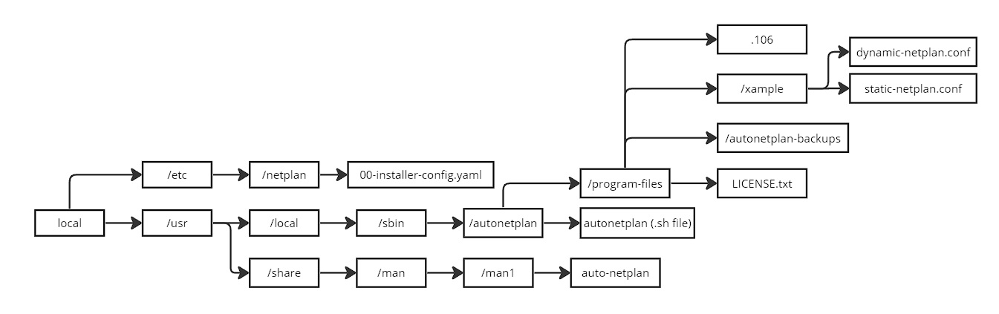

- Program by [Nisamov](https://github.com/Nisamov)
Automatic Netplan Configuration Program
This program focuses on automating the configuration of the netplan program.

Auto Netplan is a tool designed to automate network configuration on GNU/Linux systems using Netplan. It simplifies the configuration process and avoids common issues such as syntax errors or incorrect configurations.

It is recommended to follow the [guide](https://github.com/Theritex/LinuxCommands/tree/main/system_data/network_configuration/netplan_net) created by Nisamov as support during manual configuration.

The program comes with an installer, which installs the program within the operating system. To run it, you need to be within the directory or specify the path of the file for execution `bash (path)/install.sh`

## Program Structure and Visual Explanation
These examples have been created for a complete understanding of the program.

### Structure after Installation
This is the corresponding structure after running the `install.sh` script, which clones and creates paths within the system to distribute the program in a complete manner within it.

### Structure during Creation
This is the path of the files in the repository, with this scheme it is possible to trace the complete path of each file, as well as observe the creation of new ones, this scheme is simplified, to understand the complete structure of the program, it is recommended to run the following command:
```sh
# Open the file in plain text for comprehension with superuser permissions.
sudo nano ./install.sh
```

Through the previously shown image, it is possible to understand the operation and cloning of the files in the repository after executing the `install.sh` file. This file includes a section in the installation script that deletes the cloned repository, thus cleaning up space no longer needed in the system. The script for this is as follows:
```sh
# After installation, the installer will delete the cloned repository to free up space
# Check if the $SCRIPT_DIR path exists
if [[ -d "$SCRIPT_DIR" ]]; then
    # If the path exists, recursively delete the directory
    sudo rm -rf "$SCRIPT_DIR"
    # Successful deletion message
    echo "[#] The cloned repository has been recursively deleted."
else
    # If the path does not exist, display a message indicating that it does not exist
    echo "[#] The path '$SCRIPT_DIR' does not exist."
fi
```
## Installation
To install Auto Netplan, follow these steps:

Clone the repository:
```sh
sudo apt install git
git clone https://github.com/Nisamov/auto-netplan
```
Navigate to the cloned repository directory:
```sh
cd auto-netplan
```
Run the installer:
```sh
sudo bash install.sh
```
## Operations
The operations and execution possibilities after installation are as follows:
```sh
# To call the program, it is necessary to write the program name + parameters
autonetplan -x -a -s -iface -ip -ntmk
# program call + continuation with the program + automatic configuration + static ip + add interface + input fixed ip + add network mask
```
To understand the available parameters, it is recommended to read the following table:
```
    $1:_
        -h      / --help            >> Show program help
        -r      / --remove          >> Uninstall the program
        -l      / --license         >> Show program license
        -b      / --backup          >> Create backup of current network configuration
        -x      / --execute         >> Continue with program execution
    $2:_
        -m      / --manual          >> Manual configuration
        -a      / --automatic       >> Automatic configuration
    $3:_
        -f      / --fluid           >> DHCP configuration (fluid network)
        -s      / --static          >> Fixed configuration (static network)
    $4:_
        -iface  / --interface       >> Specify the interface to use afterwards
    $5:_
        -ip     / --ipconfigure     >> Specify fixed ip afterwards (only after '-s' has been previously indicated)
    $6:_
        -ntmk   / --netmask         >> Set network mask afterwards
```